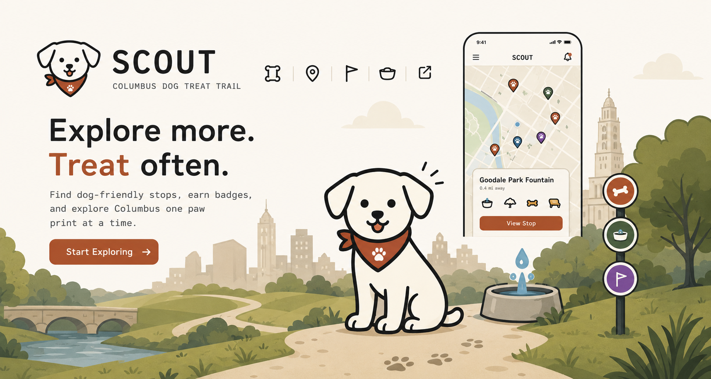

# Columbus Dog Treat Trail — Design System

## What this is

**Columbus Dog Treat Trail** is a crowdsourced, interactive map of little dog-treat stashes, stick libraries, water bowls, and toy boxes spotted on walks around Columbus, Ohio. It started after the site's creator noticed a cluster of biscuit stashes in German Village while dog walking, and is built as a companion to [Columbus PantryMap](https://github.com/steveneedham/columbus-pantry-map) — same "no build step, single static HTML file + a Google Sheet as the database" approach — but leaning "fun neighborhood find" rather than mutual aid.

The product today is **one surface**: a single-page interactive Leaflet map (`index.html`) with type filters, a verified/unverified status system, a "suggest a stop" flow, and a "near me" geolocation button. There is no separate mobile app or marketing site (yet) — the map *is* the product. The README's roadmap flags exploring a "commercial layer" — sponsored/featured pins for local pet stores, "adopt a stop" restocking partnerships — aspirational, not built; nothing in this design system invents that feature.

**Live map:** https://steveneedham.github.io/columbus-dog-treat-trail/

## Sources used to build this design system

- GitHub repo: [steveneedham/columbus-dog-treat-trail](https://github.com/steveneedham/columbus-dog-treat-trail) (branch `master`) — the original snapshot.
- User-provided updated build (`uploads/columbus-dog-treat-trail-updated/`) — the current `index.html`, `README.md`, one real seed stop ("Lost & Hounds", a pet store at 364 E Whittier St, already verified), status v0.1 (seed), and the mailto-based "suggest a stop" fallback (no form live yet).
- User-provided official logo sheet (`uploads/dog-treat-trail-logo.svg`) — four lockup variants: primary mark (app icon/favicon base), horizontal lockup (site header/email signature/letterhead), 100×100 rounded-square favicon, and a single-color watermark/stamp variant. All four are now in `assets/`.
- User-provided email signature (`uploads/dog-treat-trail-email-signature.html`) — confirms the horizontal lockup as the header signature mark and the rust `#B5502C` top-border accent.
- **Explore these yourself** for more context than this design system captures: the repo's `SETUP.md` (not re-attached in the update) covers the full Google Sheet/Form/Apps Script data pipeline, which isn't a visual concern but matters if you're prototyping the review/approval workflow.

## Components (in `components/core/`)

The source app only had one page's worth of chrome — so the component inventory is small and literal, built to match its actual CSS classes (`.btn`, `.chip`, `.badge`, `.legend`/`.filters`, popup, modal, brand lockup) rather than a generic "standard set":

- **Button** — `.btn` / `.btn.primary`
- **Chip** — filter toggle with color dot
- **Badge** — verified / unverified / seasonal status pill
- **Panel** — bordered floating box (hosts the filter list and the legend)
- **MapPin** — the Leaflet marker dot (type color + status ring, dashed if seasonal)
- **PopupCard** — the map-pin popup (name, photo, meta, notes, actions)
- **Modal** — the "Suggest a stop" dialog
- **Brand** — logo lockup + mono eyebrow subtitle

No components beyond this list were added.

## UI kit

- `ui_kits/map-app/` — a click-through recreation of the live map: topbar with the real brand lockup, working filter chips, a Leaflet map with styled pins, popups with a live "Mark verified" action, and the suggest-a-stop modal. Open `index.html`.

## Foundations

- `tokens/colors.css`, `tokens/typography.css`, `tokens/spacing.css`, `tokens/effects.css` — all imported by root `styles.css`.
- `guidelines/` — 11 specimen cards covering colors (core palette, stop-type colors, status colors), type (display/body/mono), spacing (scale, radii), and brand (hard-offset shadows, logo, map filter treatment).
- `assets/logo-lockup.svg` (horizontal lockup), `assets/mark-paw-compass.svg` (primary circular mark), `assets/favicon-paw.svg` (100×100 rounded-square favicon), `assets/mark-single-color.svg` (single-color watermark/stamp variant) — **all four are the brand's official logo files**, provided directly by the user.

## Content fundamentals

**Voice:** first-person-plural, casual, transparent about being a work in progress. The README openly says the map is at "v0.5" with "one placeholder pin... marked unverified pending an on-foot check" — the brand doesn't hide that this is an early, hand-built dataset. Copy leans conversational over corporate: "Seen a treat stand, stick library, water bowl, or toy box on a walk? Tell us where — we'll verify it on foot before it goes live."

**You vs. we:** submission-form copy addresses the reader directly ("you", "your submission") while site copy about the *process* uses "we" ("we'll verify it on foot"). It reads like one person (there is, in fact, one maintainer) talking to a neighbor, not a company talking to "users".

**Casing:** sentence case everywhere in running copy. UI labels and eyebrows (subtitle, badges, legend, buttons) are consistently **UPPERCASE + letter-spaced**, set in mono — that's the one place the brand goes shouty, and it's a deliberate "field notebook / stamped label" texture, not emphasis.

**Honesty/transparency as a value:** the whole product is built around not overclaiming — "Verified" vs "Unverified" is the core UX conceit, submissions require a human to walk and confirm them before they're trusted, and the README documents exactly what's automated vs. manual (e.g. "flipping something to verified still means walking it and hand-correcting the coordinates").

**Emoji:** used sparingly and functionally, never decoratively — 📍 on the "Near me" button (universally-understood location glyph), 🐾 as the favicon mark only. No emoji in headings, badges, or body copy.

**Submission guidelines tone:** plainspoken and practical, e.g. "It should be easy to find," "Keep it family- and dog-friendly" — short imperative bullets, no legalese.

## Visual foundations

**Overall vibe:** warm, hand-labeled, "field notebook meets vintage trail map" — parchment background, ink outlines, hard offset shadows (like a rubber-stamped card), small consistent radii. Not a soft, rounded, gradient-driven modern SaaS look.

**Colors:** warm neutral base — `paper` #EDE6D6 (app background), `paper-dark` #E2D9C4, `white` #FBF9F3 (card surfaces), `ink` #2B2A26 (near-black, all text + borders), `ink-soft` #5B5648 (secondary text/meta). Three named accents used consistently for meaning, not decoration: `rust` #B5502C (primary action / treat-stand marker), `moss` #4C6B4F (verified status / stick-library marker), `amber` #C68A2E (unverified status / mixed marker). Two more accents exist only as stop-type marker colors: a muted blue `#3E6E8E` (water bowl) and a muted purple `#8A5FB0` (toy box). No gradients except one very subtle vertical fade on the topbar (paper → transparent, for legibility over the map) — never used for buttons or cards.

**Type:** three families, each with one job. **Fraunces** (serif, 500–700) for anything with personality — stop names, modal headings, the wordmark — never for UI chrome. **Inter** (sans, 400–600) for body copy and button/chip labels — the "normal talking" voice. **JetBrains Mono** (400–700) for anything that reads as metadata or a label — eyebrows, badges, popup meta lines, the legend, the footer — always uppercase and letter-spaced when used this way.

**Spacing:** tight and compact — an 4–24px scale, not the generous 8/16/24/32/48 rhythm of typical SaaS. Panels use ~10px internal padding; buttons ~9×14px. This is a dense, utilitarian map overlay UI, not a spacious marketing page.

**Backgrounds:** solid `paper` fill behind everything; the map itself is real OpenStreetMap tiles run through a CSS filter (`saturate(0.9) sepia(8%) brightness(1.02)`) so it reads as aged/warm rather than a stock Google-Maps blue. No photographic hero imagery, no illustrated patterns, no textures beyond that map-tile filter.

**Animation:** minimal and functional only — a 0.12s ease transform/background transition on button hover, and a scale(0.97) press state. No entrance animations, no bounces, no parallax.

**Hover states:** buttons *invert* (white↔ink, or rust→darker rust) rather than lightening or adding a glow — a firm, high-contrast hover, consistent with the ink-bordered aesthetic.

**Press states:** `transform: scale(0.97)` — a small tactile shrink, no color change, no elevation change.

**Borders:** thick and load-bearing, always solid `ink` (or an accent color for status rings), 1.5–2px. Borders are a primary structural device here — cards, buttons, and panels are all defined by their border first, shadow second, radius a distant third. This is the opposite of a borderless/shadow-only modern UI.

**Shadows:** flat, hard-offset, zero blur — `2px 2px 0`, `3px 3px 0`, `5px 5px 0` in translucent ink, scaling with the "importance" of the surface (chips/panels smallest, popups medium, the modal largest). Reads as a printed card catching light, not a soft elevation system.

**Corner radii:** small and consistent, 2–5px. Never pill-shaped, never fully rounded — a stamped-label/card feel, not a soft rounded-corner feel.

**Cards (popups):** white fill, 1.5px ink border, 4px radius, medium hard shadow, fixed 230px width. Structure is always: serif name → optional photo → mono meta line (type · neighborhood · status badge) → optional italic venue note → body notes → action buttons.

**Transparency/blur:** used exactly once — the topbar's gradient fade uses `rgba` opacity, no `backdrop-filter`/blur anywhere in the source. Popups and panels are fully opaque.

**Imagery color vibe:** no photography is baked into the design system (submitted stop photos are user-generated and unpredictable) — the one deliberate "photographic" treatment is the map-tile filter described above: warm, slightly desaturated, sepia-tinted.

- **Intentional addition:** `assets/mascot/` introduces **Scout**, a friendly puppy mascot (ink-line style matching the icon set, red bandana with a paw print) for onboarding, empty states, and loading moments — not in the source, added per user direction. `scout-mark.svg`/`scout-lockup.svg` are the base marks; `scout-happy/wink/curious/calm/excited.svg` are expression variants; `scout-badge-*.svg` are colored medallions for the milestone badge set. `Brand`'s new `mascot` prop shows the mark alongside the wordmark. See the "Scout — App Mascot" and "Scout — Badge Medallions" cards in Brand. **A full-body Scout illustration (e.g. the sitting hero pose) is intentionally left as an image slot, not hand-coded SVG** — hand-coded attempts didn't match the reference art quality; `ui_kits/marketing/landing.html` has an open `<image-slot>` for the real artwork.

- **Fun addition:** `assets/audio/trail-of-treats.mp4` is the team's official song, "Trail of Treats," provided by the user. See the "Official Song" card in Brand.

- **No icon font or SVG icon set exists in the source.** The only iconography is: (1) the inline SVG logo/mark (paw print + compass/signpost, extracted to `assets/`), (2) a single 📍 emoji used functionally on the "Near me" button, and (3) plain text glyphs (`+`, `→`) used as button affordances instead of icons (e.g. "+ Suggest a stop", "Open the form →").
- **Recommendation for new icons:** if a consuming project needs a proper icon set (e.g. for a future mobile app), match the hand-drawn, single-color-line quality of the existing paw/compass mark rather than dropping in a generic modern icon font — a rounder, friendlier stroke-based set (e.g. Lucide at a heavier stroke weight) would blend in better than a sharp geometric set. This is a **substitution recommendation**, not something already in the source — flag it to the user before treating it as brand truth.
- **Intentional addition:** `assets/icons/` now has a small hand-drawn-weight line-icon set (treat, stick, water bowl, map pin, stop, directions, verified) since the source defines none. `currentColor` stroke, 1.75px weight, 24×24 viewBox — matches the paw mark's linework rather than a generic icon font. See the "Icon Set" and "Icon Set — Actions" cards in Brand.
- **Intentional addition:** `ui_kits/map-app/routes.html` sketches two map modes not in the source: "Suggest a walk" (a treat-dense loop connecting verified stops, start/end highlighted) and "Explore" (fades confirmed stops, rings unverified ones needing an on-foot check) — both plausible next features given the verify-on-foot model, flagged as additions.
- **Intentional additions (further screens):** `moderation.html` (admin queue for pending submissions, echoing the source repo's `approval.gs`/`verify.gs` Sheet workflow), `stop-detail.html` (shareable full-page view of one stop), `neighborhoods.html` (browse-by-neighborhood collections), `trail-flier.html` (printable bulletin-board route card, built on the paginated-document shell). `guidelines/content-digest-email.html` sketches weekly-digest email copy in the brand voice, and `guidelines/brand-night-map-filter.html` sketches a dusk map-tile treatment for night walks. `PopupCard`'s directions action now links out to both Google Maps and Apple Maps rather than one hardcoded provider. (first stop, streak, explorer, star) and `components/feedback/Toast.jsx` adds a confirmation toast — neither exists in the source but both pair naturally with the "Mark verified"/"Suggest a stop" actions and the avatar leveling system. `MapPin`'s `sponsored` prop (amber ring + star) is a visual sketch of the README's "commercial layer" roadmap item. See `ui_kits/map-app/profile.html` (leaderboard + badges + level progress), `onboarding.html` (3-screen intro), and `mobile-frame.html` (onboarding in an iOS bezel) for how these compose. `guidelines/brand-seasonal-filter.html` and `brand-empty-states.html` sketch a winter/autumn map tile treatment and no-pins/GPS-denied/offline states, also intentional additions. (varied ears/markings, palette-rotated circle backgrounds) for a gamified contributor profile — not a free pick, but an earned progression. Each contributor is assigned one of the 10 base faces at signup, starting "locked" (`avatar-04-locked.svg`, greyed out) until their first verified stop unlocks full color; a collar is earned at 3 verified stops (`avatar-04-tier2-collar.svg`) and a crown at 10 (`avatar-04-tier3-crown.svg`). The 4-stage progression is shown on the "Avatar Set" card in Brand — apply the same locked/collar/crown overlays to any of the 10 base faces for other contributors.
- **Intentional addition:** `assets/icons/social/` has generic share/copy-link/email/message icons plus simplified outline glyphs for Facebook, X, Instagram, and WhatsApp, for a future "share this stop" action. Same `currentColor` line style as the rest of the set; platform glyphs are generic simplified outlines, not the platforms' official logo marks. See the "Social Sharing Icons" card in Brand.
- **Intentional addition:** `near-me.svg`, `toy.svg`, `report-problem.svg` in `assets/icons/` — near-me replaces the 📍 emoji currently on that button, toy pairs with the toy-box stop type, and report-problem is a plausible future action on unverified/stale stops. See the "Icon Set — Utility" card in Brand.
- **Pulled from the production repo:** `directions.svg`, `verified.svg`, `unverified.svg` (see "Icon Set — Actions" card in Brand) and `assets/mascot-scout.svg`/`assets/scoutheaderart.png` — the live implementation built its own versions of these that this design system didn't have yet; copied back in so the two stay in sync. **Resolved divergence:** production's `profile.html` currently lets contributors freely choose any base avatar face — this design system's earned-unlock behavior (locked → collar → crown, tied to verified-stop milestones) is the canonical intent going forward; production should be updated to match.
- **Also pulled from production:** `assets/site.css`/`assets/site.js` (shared page chrome + the `CDTTSite.brandLockupHTML()` helper every production page uses for its topbar), `assets/stops-client.js` (`CDTT.loadStops()` / `CDTT.distanceMiles()` / `CDTT.escapeHtml()` — the shared stop-data-loading and distance-calc layer), and `assets/analytics.js` (GA4 loader). These are reference copies of the real runtime layer behind production's pages — not part of this design system's own component bundle, but useful context for anyone building the next production page off this system.
- **Intentional addition:** `ui_kits/map-app/scoutsights.html` — a maintainer-only GA4 analytics screen (users/sessions/engagement stat tiles, a sessions sparkline, and an anonymous location-ping heatmap), matching production's `scoutsights.html`. Both panels are designed to show a clean "not configured" empty state until real GA4/Sheet data is wired up — never a broken or partial UI.
- **Mirrors production:** `ui_kits/map-app/signup.html` — the "Join the trail" Google sign-in account screen (two-panel layout: value props on paper-dark, sign-in card on white), matching production's `signup.html`.
- **Mirrors production:** `ui_kits/map-app/promo.html` — the "Design your promo" business self-serve wizard (5-step: intro → business info → offer details → live preview → confirmation), matching production's `promo.html`. Uses the `MapPin`'s `sponsored` visual language (amber ring + star badge) in the preview step.
- **Intentional addition:** mobile-first responsive layout on `ui_kits/map-app/index.html` — below ~640px the topbar stacks, the legend hides, and filters dock to a bottom sheet — plus `assets/pwa/manifest.webmanifest` and `assets/pwa/sw.js`, a reference installable-PWA setup (Add to Home Screen, offline app-shell cache) so the map can be used like a native app with no app-store step. See the "Mobile & PWA" card in Brand.
- **Intentional addition:** a "That's you!" self-marker modal on `ui_kits/map-app/index.html`, shown after "Near me" locates the walker — prompts an anonymous visitor to join the trail (→ `signup.html`) or pick a name, rather than showing a permanently greyed-out default pin. "Pick a name" demonstrates panning the map to another area (German Village) as a stand-in for a future name-picker flow.
- **Intentional addition:** `ui_kits/map-app/about.html` — an "About & Why" page (origin story, the verify-on-foot philosophy, the PantryMap connection) for a footer/nav link — the source had no dedicated about page.
- Unicode/emoji are otherwise avoided in the UI; the brand's "icons" are really just its color-coded marker dots (see Colors → Stop-Type Colors) and mono-label text.

## Index

- `styles.css` — root stylesheet, imports everything under `tokens/`
- `tokens/` — colors, typography, spacing, effects (shadows/motion) as CSS custom properties
- `guidelines/` — 11 specimen cards (Colors, Type, Spacing, Brand groups)
- `components/core/` — 8 React components + matching `.d.ts`/`.prompt.md`/card HTML (Button, Chip, Badge, Panel, MapPin, PopupCard, Modal, Brand)
- `ui_kits/map-app/` — interactive recreation of the live map app
- `assets/` — logo lockup, standalone mark, favicon (all extracted from the source SVG)
- `thumbnail.html` — homepage tile for this design system
- `guidelines/reference/` — source reference materials (e.g. the Partner Walkthrough PDF)
- `SKILL.md` — portable skill file for using this system in Claude Code or elsewhere

## Caveats

- This is a **one-page product** — there's no separate "app" vs "website" split to build multiple UI kits for, and no slide deck was provided, so no slide templates exist here.
- No logo caveat — an official 4-variant logo sheet was provided and is now in `assets/`.
- Fonts (Fraunces, Inter, JetBrains Mono) are all real Google Fonts already used by the live site — loaded via the standard Google Fonts CDN `@import` in `tokens/typography.css`, not self-hosted. No font substitution was needed.
- Icon system is effectively empty in the source (see Iconography above) — flagged as a gap rather than papered over with invented icons.

## Ask

This system is built from exactly one HTML file — solid ground for tokens and the existing chrome, but thin for anything beyond the current map view (no settings screen, no onboarding, no admin/moderation UI, despite `approval.gs`/`verify.gs` implying real moderation happens somewhere). **If you can share more — a Figma file, screenshots of the Sheet-based moderation workflow, or a sketch of the "commercial/sponsored pins" feature from the roadmap — I can extend this system rather than guess at it.** Also let me know if the icon-system gap above should be filled with a real set now, or left open until you pick one.
